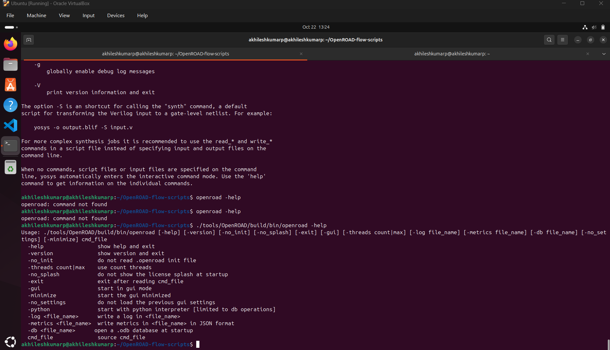

OpenROAD is an open-source, autonomous physical design flow for digital integrated circuits from RTL to GDSII. It provides a complete toolchain for chip design including synthesis, floorplanning, placement, routing, and verification. 
Official website: [https://openroad.readthedocs.io](https://openroad.readthedocs.io) 
GitHub: [https://github.com/The-OpenROAD-Project](https://github.com/The-OpenROAD-Project) 

OpenROAD installation guide:

step 1 : Clone openroad repo 
cmd : git clone --recursive https://github.com/The-OpenROAD-Project/OpenROAD-flow-scripts

cmd : cd OpenROAD-flow-scripts

step 2: Run the Setup Script
cmd : sudo ./setup.sh

step 3: Build OpenROAD
cmd: ./build_openroad.sh --local
(use "./build_openroad.sh --local --threads 1" if you are facing build errors at the end because of memory/resourse issues)

step 4: Verify installation
cmd: 
source ./env.sh
yosys -help  
openroad -help

if yosys is not installed properly then go inside yosys folder within the tools, and run "make" insdie the ./tools/yosys/ folder

Errors while installations can be debugged/fixed by using the ways mentioned in the document: 
[OpenROAD Error Fixes Guidance](../doc/openroad_error_fixes_guidance_Akhilesh.pdf)

verify the above steps.
This concludes the installation of the OpenROAD.