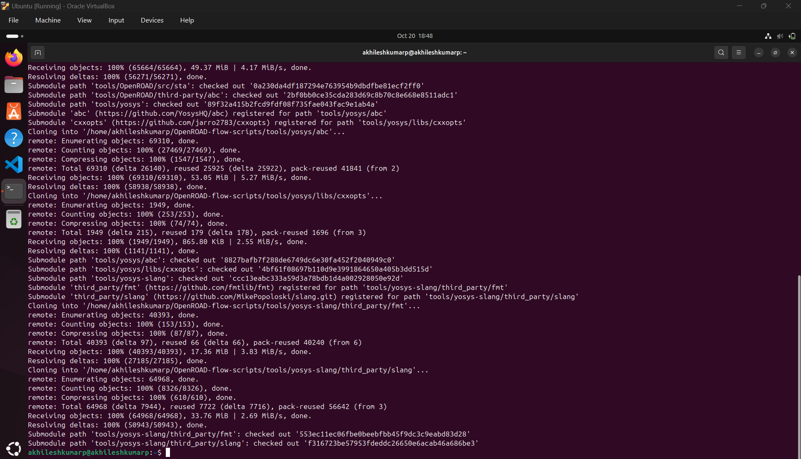
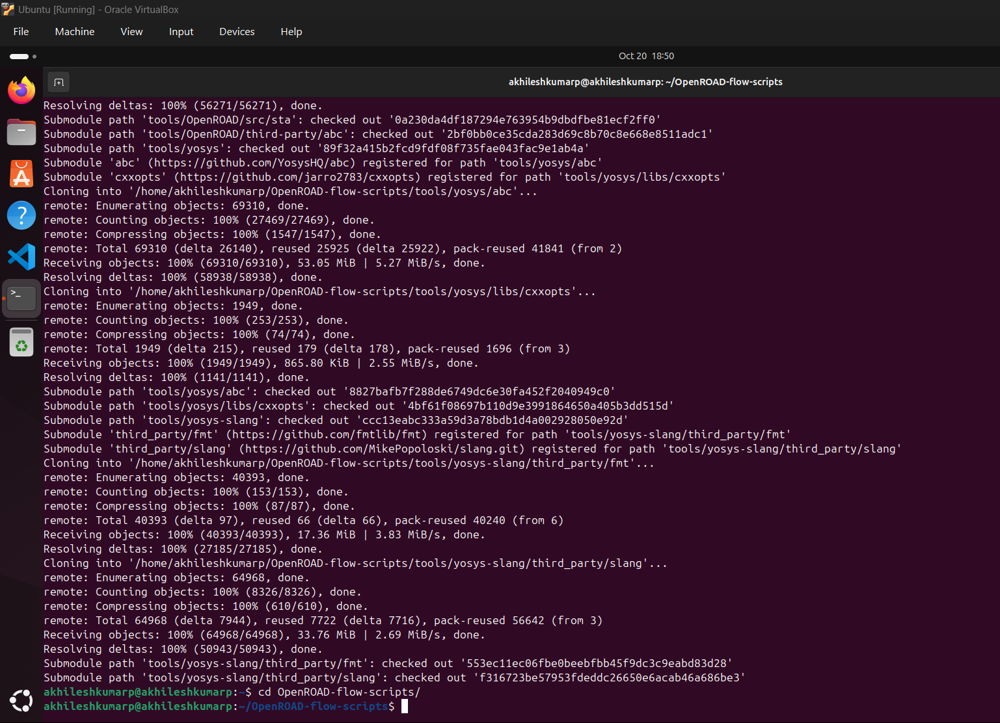
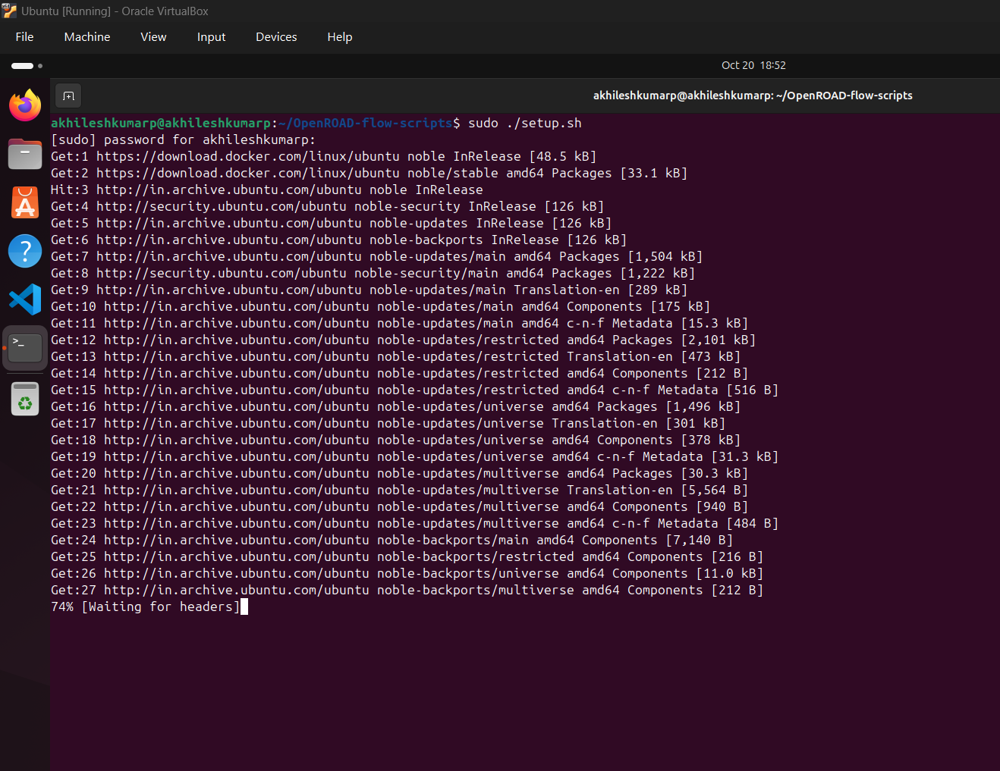
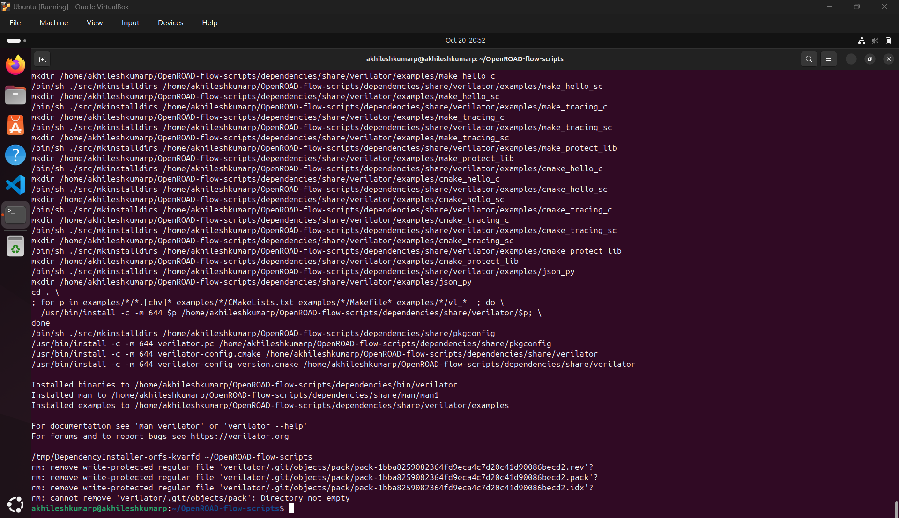
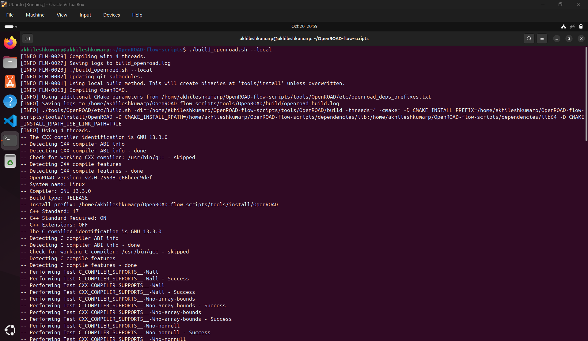
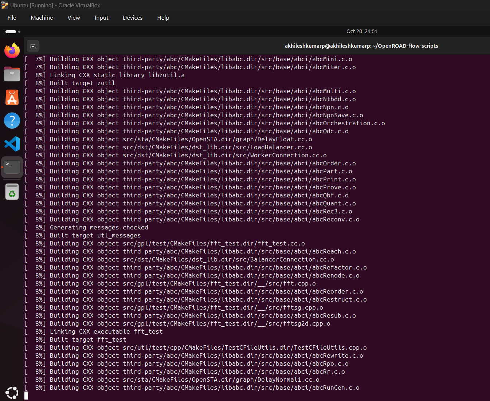

OpenROAD installation guide:

step 1 : Clone openroad repo 
cmd : git clone --recursive https://github.com/The-OpenROAD-Project/OpenROAD-flow-scripts

cmd : cd OpenROAD-flow-scripts

step 2: Run the Setup Script
cmd : sudo ./setup.sh

step 3: Build OpenROAD
cmd: ./build_openroad.sh --local
(use "./build_openroad.sh --local --threads 1" if you are facing build errors at the end because of memory/resourse issues)

step 4: Verify installation
cmd: 
source ./env.sh
yosys -help  
openroad -help

yosys_openroad_installed.png

verify the above steps.
This concludes the installation of the OpenROAD.