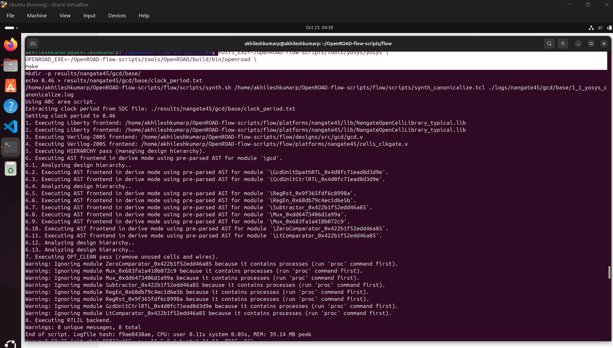
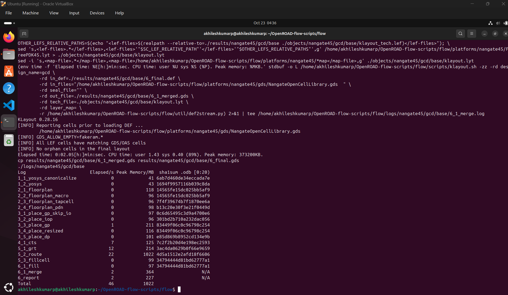
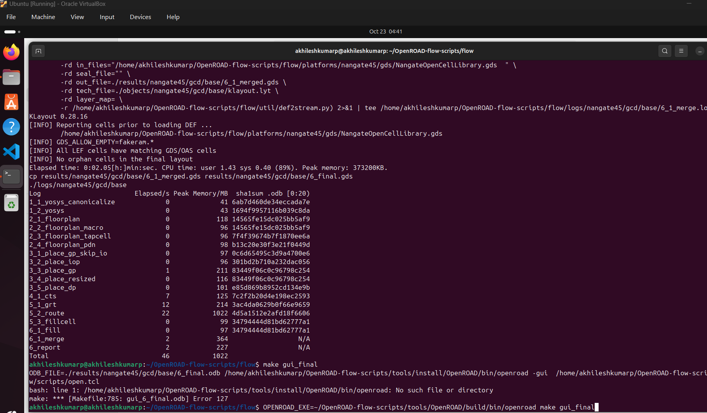
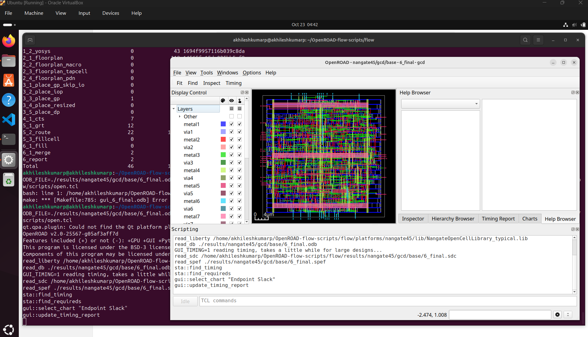
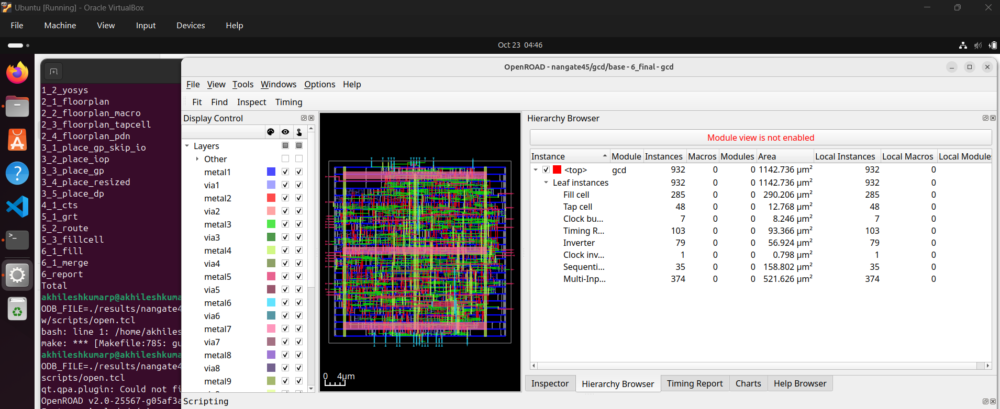
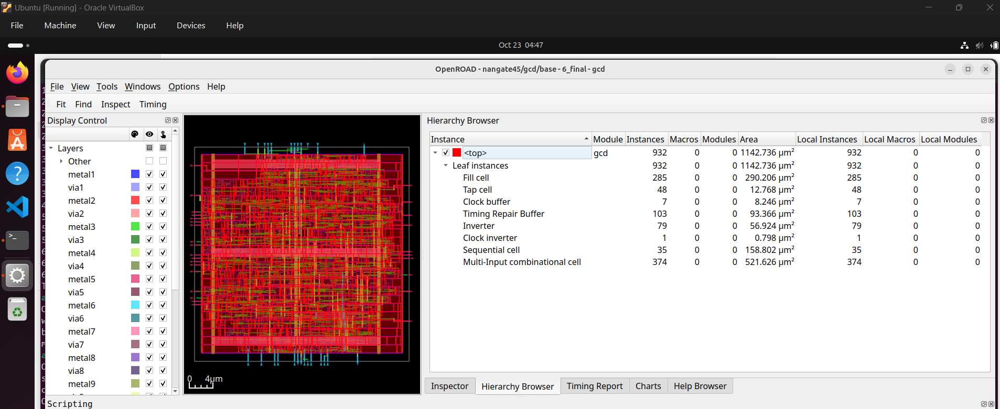
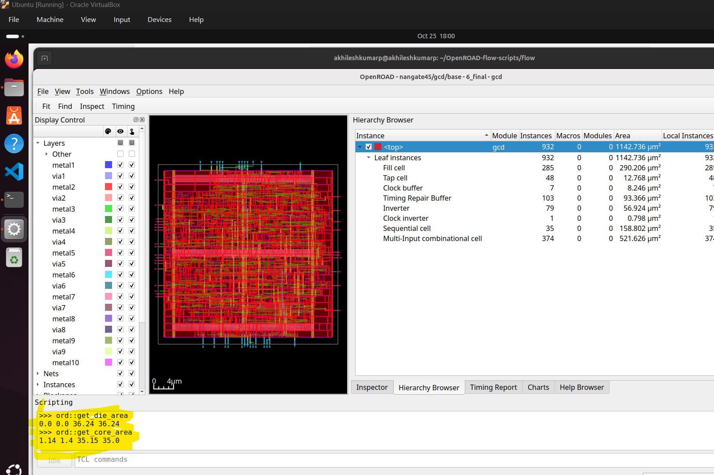
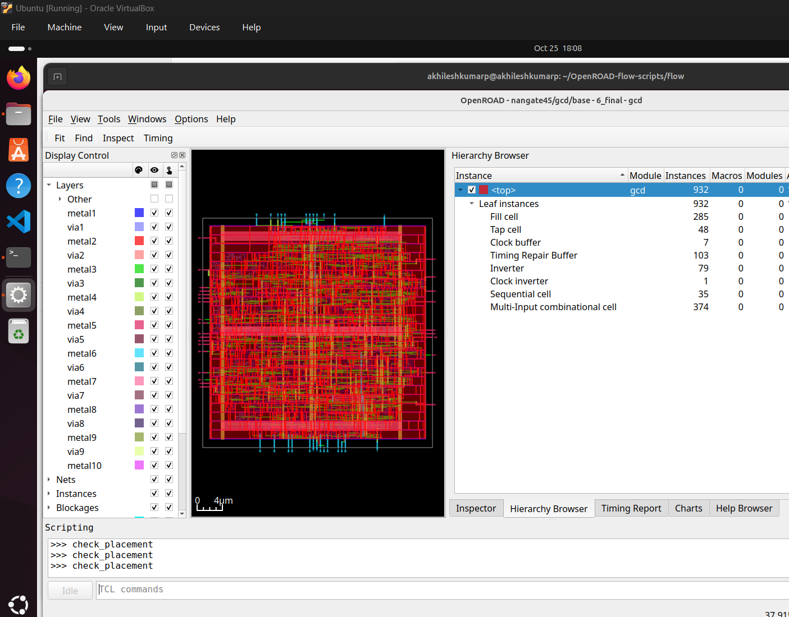

## Execute Floorplan and Placement with OpenROAD

This tutorial demonstrates running the complete OpenROAD digital design flow.

**Step 1: Run the OpenROAD flow**
Navigate to the flow directory and execute as below.

cmd: 
cd flow
make
(if there is issue use the below kind of command
YOSYS_EXE=~/OpenROAD-flow-scripts/tools/yosys/yosys \
OPENROAD_EXE=~/OpenROAD-flow-scripts/tools/OpenROAD/build/bin/openroad \
make)

**Step 2: Launch the GUI for visualization**
Open the graphical interface to view your completed chip layout.
This shows the final placement of all components and routing paths.

Launch the graphical user interface (GUI) to visualize the final layout
cmd:  make gui_final

**Step 3: Check Core and Die Areas**
These commands report the physical dimensions of the chip design.
Use them to verify the layout meets the size requirements.

Core Die area below: 
cmd: 
ord::get_core_area
ord::get_die_area

ord::get_die_area -> 0.0 0.0 36.24 36.24

This command reports the chip's total physical boundary in microns. The coordinates (0, 0) define the bottom-left corner, and (36.24, 36.24) define the top-right corner. This is the complete "canvas" of the chip, representing its absolute outer edges. It contains everything, including the logic core, I/O pads, and power rings.

ord::get_core_area -> 1.14 1.4 35.15 35.0

This command reports the usable area for placing your standard cells (logic). Its corners are at (1.14, 1.4) and (35.15, 35.0), sitting inside the die area. This is the "red square" of logic visible in the GUI. The space between this core and the die edge is the margin reserved for I/Os and power.

The cmd: "check_placement" ran without error confirms no errors in placements.

verify the above steps.
This concludes the floorplan view and placement using the OpenROAD.
